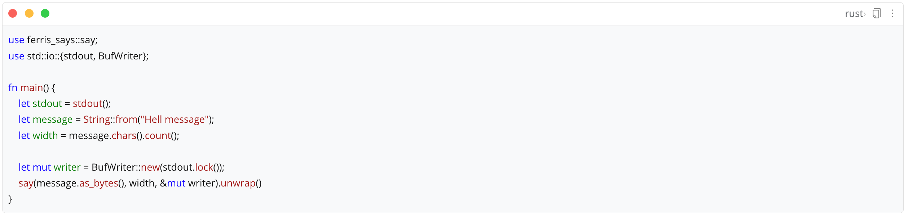
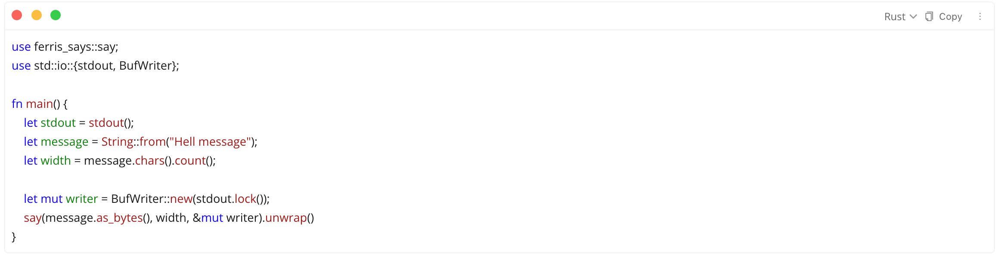
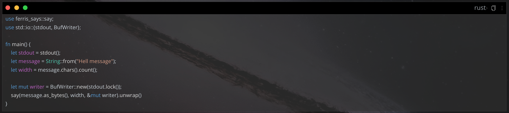
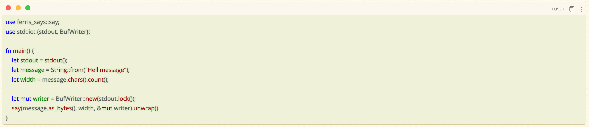

[中文](README_zh_CN.md)

# siyuan-plugin-code-block

Imitate the Mac-style code block style, and specially adapt to popular themes such as Rem Craft, Savor, Dark+, HBuilderX, etc.️

## Show results

### Zhihu

Remarks: This code block style is extracted from my [Zhihu theme](https://github.com/terwer/siyuan-theme-zhihu). [Manual dog head]

You can uninstall this plugin and use the Zhihu theme directly. Of course, you can also use this plugin to use the following adapted themes. PS: The default theme is also supported.

### Rem Craft

## Savor

### Dark+

### HBuilderX-Light

## FAQ

* Q1: How to use? Need an action button?

  A1: This plugin has no operation buttons. After downloading and enabling the plugin, open the document, and the code block will be automatically beautified into Mac style. Gone.

  If you don't want to use this plugin, you can directly use [Zhihu Theme](https://github.com/terwer/siyuan-theme-zhihu) or dig out the [Code Block](https://github.com/terwer/siyuan-theme-zhihu/tree/main/style/theme/code-block) related css.

## Donate

If you approve of this project, invite me to have a cup of coffee, which will encourage me to keep updating and create
more useful tools~

### Wechat

### Alipay

## Thanks

Thanks to [frostime](https://github.com/siyuan-note/plugin-sample-vite-svelte) for the project template