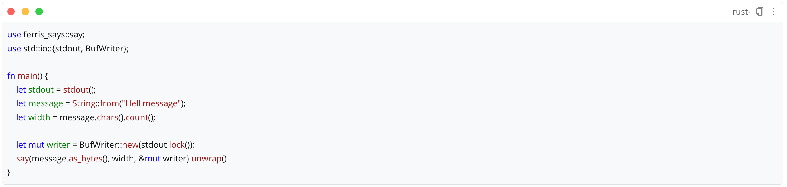
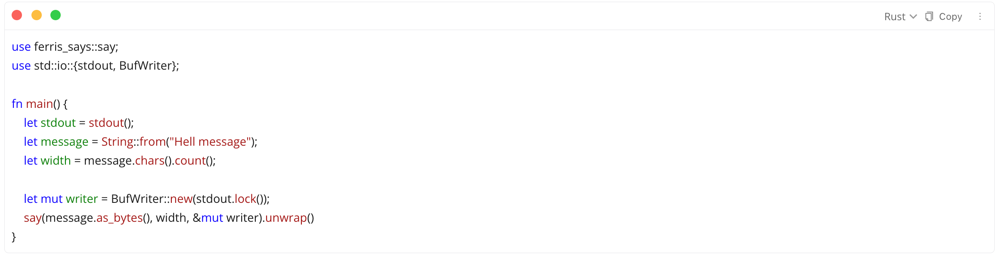
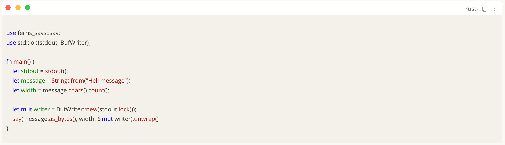
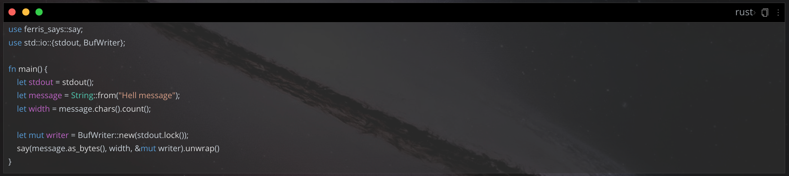
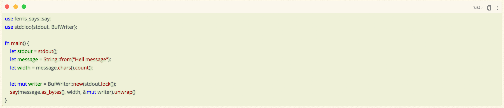

[English](README.md)

# 代码块美化

模仿Mac风格的代码块风格，并且对Rem Craft、Savor、Dark+、HBuilderX等热门主题进行专门适配

## 效果展示

### Zhihu

备注：这个代码块样式就是从我的 [Zhihu主题](https://github.com/terwer/siyuan-theme-zhihu) 抠出来的。[手动狗头]

您可以卸载此插件，直接使用 Zhihu主题，当然，您也可以使用此插件，用以下经过适配的主题。PS：默认主题也支持。

### Rem Craft

## Savor

### Dark+

### HBuilderX-Light

## FAQ

* Q1：怎么使用？需要操作按钮吗？

  A1：本插件没有操作按钮。下载并启用插件之后，打开文档，代码块就自动美化成 Mac 风格。没了。

  如果你不想用这个插件，可直接使用 [Zhihu主题](https://github.com/terwer/siyuan-theme-zhihu) 或者自行去抠 [代码块](https://github.com/terwer/siyuan-theme-zhihu/tree/main/style/theme/code-block) 相关的css。

## 捐赠

如果您认可这个项目，请我喝一杯咖啡吧，这将鼓励我持续更新，并创作出更多好用的工具~

### 微信

### 支付宝

## 感谢

感谢 [frostime](https://github.com/siyuan-note/plugin-sample-vite-svelte) 提供的项目模板